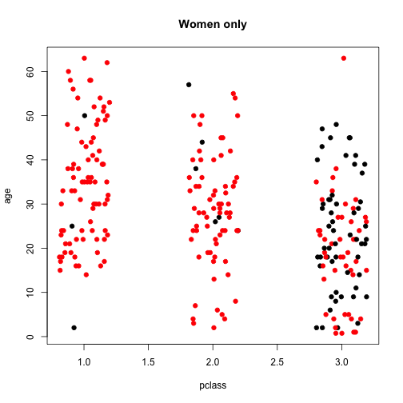
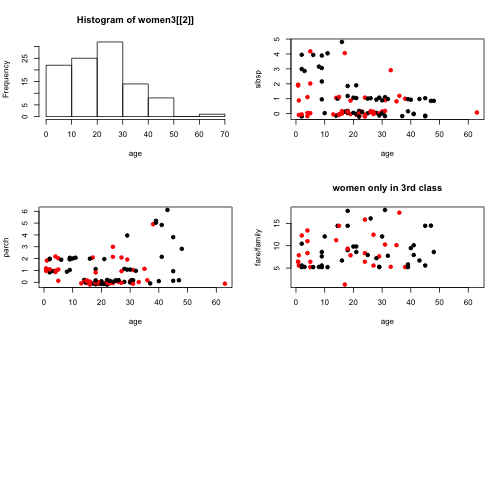
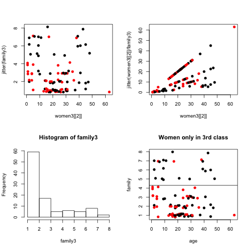
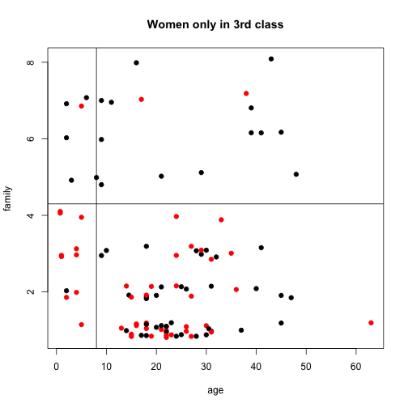
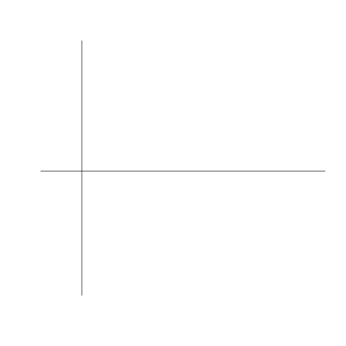
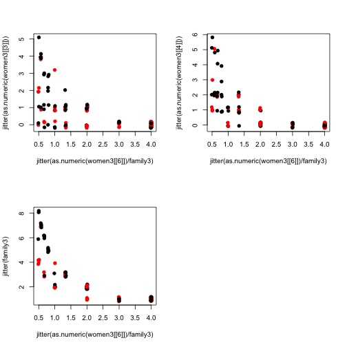
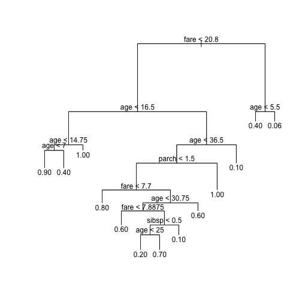
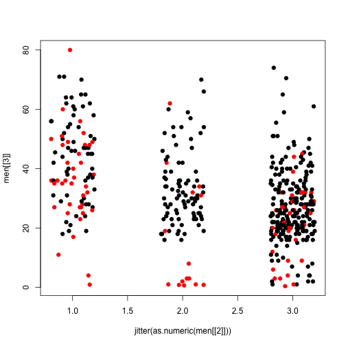
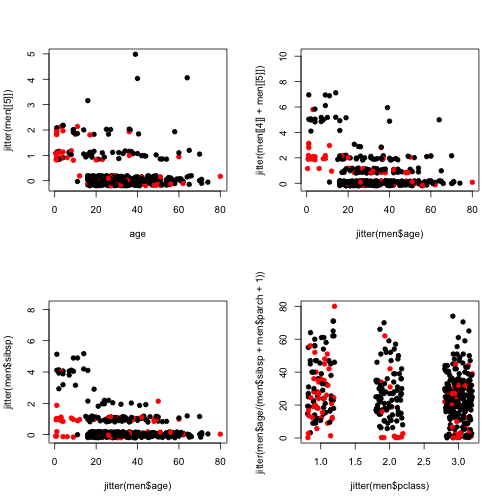
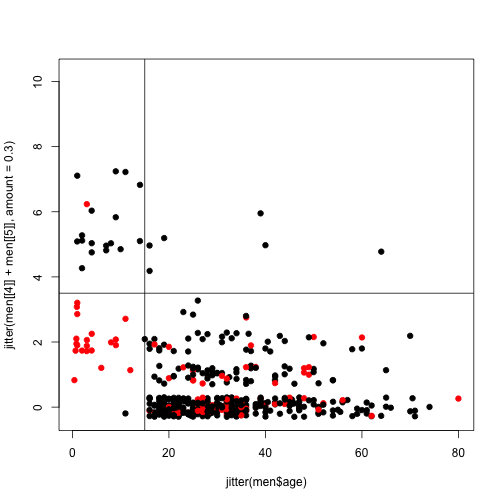

# Data exploration on raw data


### Setting 

```r
library(tree)
require(maptree)
```

```
## Loading required package: maptree
```

```
## Loading required package: cluster
```

```
## Loading required package: rpart
```

```r
library(randomForest)
```

```
## randomForest 4.6-7
```

```
## Type rfNews() to see new features/changes/bug fixes.
```

```r
setwd("/Users/aszostek/Projects/Kaggle/Titanic")
source("./Utils/submission_utils.R")
train <- read.csv(file = "./Data/train.csv")
test <- read.csv(file = "./Data/test.csv")
```


## Survival among sexes

```r
table(train[[1]], train$sex)
```

```
##    
##     female male
##   0     81  468
##   1    233  109
```


If only sex is taken into account in prediction - allwomen survive all men don't then the accuracy is 78% - not bad!

```r
(nrow(train[train$sex == "female" & train$survived == 1, ]) + nrow(train[train$sex == 
    "male" & train$survived == 0, ]))/nrow(train)
```

```
## [1] 0.7868
```

so just among women prediction accuracy is:

```r
(nrow(train[train$sex == "female" & train$survived == 1, ]))/nrow(train[train$sex == 
    "female", ])
```

```
## [1] 0.742
```

and among men

```r
(nrow(train[train$sex == "male" & train$survived == 0, ]))/nrow(train[train$sex == 
    "male", ])
```

```
## [1] 0.8111
```

If we could improve each of them, it would be great!

## Women

```r
women <- train[train$sex == "female", c(-3, -4)]
```


```r
par(mfrow = c(1, 1))
#
# plot(jitter(as.numeric(women[[2]]),amount=0),as.numeric(women[[4]]),col=as.factor(women[[1]]),pch=19)
# plot(women[[2]],women[[4]],col=as.factor(women[[1]]),pch=19)
plot(jitter(as.numeric(women[[2]])), women[[3]], col = as.factor(women[[1]]), 
    pch = 19, xlab = "pclass", ylab = "age", main = "Women only")
```

 

So it looks like women in first class are more probable to survive, so lets say new rule, woman, class 1 and 2 survives, else, not

```r
table(women[[1]], women[[2]])
```

```
##    
##      1  2  3
##   0  3  6 72
##   1 91 70 72
```

So what is acuracy for women now?

```r
(nrow(women[(women$pclass == 1 | women$pclass == 2) & women$survived == 1, ]) + 
    nrow(women[women$pclass == 3 & women$survived == 0, ]))/nrow(women)
```

```
## [1] 0.742
```

So the accuracy if i take all women from 1st and 2nd class as surviving and 3rd class as not surviving is 0.742. This is not an improvement with respect to previous prediction. So lets look now ad womrn in 3rd class only!

```r
women3 <- women[!is.na(women$age) & women$pclass == 3, c(-2, -6, -8)]
womrn3$family <- as.numeric(women3[[3]] + women3[[4]] + 1)
```

```
## Error: object 'womrn3' not found
```

```r
family3 <- as.numeric(women3[[3]] + women3[[4]] + 1)
```

Lets see different plots
#### Age correlations

```r
names(women3)
```

```
## [1] "survived" "age"      "sibsp"    "parch"    "fare"     "embarked"
```

```r
par(mfrow = c(3, 2))

hist(women3[[2]], xlab = "age")
plot(women3[[2]], jitter(women3[[3]]), pch = 19, col = as.factor(women3[[1]]), 
    xlab = "age", ylab = "sibsp")

plot(women3[[2]], jitter(women3[[4]]), pch = 19, col = as.factor(women3[[1]]), 
    xlab = "age", ylab = "parch")
plot(women3[[2]], jitter(women3[[6]]), pch = 19, col = as.factor(women3[[1]]), 
    xlab = "age", ylab = "fare")
```

```
## Error: 'x' must be numeric
```

```r

plot(women3[[2]], jitter(women3$fare/(women3[[3]] + women3[[4]])), pch = 19, 
    col = as.factor(women3[[1]]), xlab = "age", ylab = "fare/family")
title(main = "women only in 3rd class")
```

 


```r
par(mfrow = c(2, 2))
plot(women3[[2]], jitter(family3), pch = 19, col = as.factor(women3[[1]]))
plot(women3[[2]], jitter(women3[[2]]/family3), pch = 19, col = as.factor(women3[[1]]))
hist(family3)
plot(women3[[2]], jitter(family3), pch = 19, col = as.factor(women3[[1]]), xlab = "age", 
    ylab = "family", main = "Women only in 3rd class")
abline(h = 4.3)
```

 


```r
par(mfrow = c(1, 1))
plot(women3[[2]], jitter(family3), pch = 19, col = as.factor(women3[[1]]), xlab = "age", 
    ylab = "family", main = "Women only in 3rd class")
abline(h = 4.3)
abline(v = 8)
```

 


```r
par(mfrow = c(1, 1))
plot(women3[[2]], jitter(family3), pch = 19, col = as.factor(women3[[8]]), xlab = "age", 
    ylab = "family", main = "Women only in 3rd class")
```

```
## Error: subscript out of bounds
```

```r
abline(h = 4.3)
abline(v = 8)
```

 

```r
# names(women3)
```


```r
par(mfrow = c(2, 2))
plot(jitter(as.numeric(women3[[8]])), women3[[2]], pch = 19, col = as.factor(women3[[1]]))
```

```
## Error: subscript out of bounds
```

```r
plot(jitter(as.numeric(women3[[8]])), jitter(family3), pch = 19, col = as.factor(women3[[1]]))
```

```
## Error: subscript out of bounds
```

```r
plot(jitter(as.numeric(women3[[8]])), jitter(women3[[3]]), pch = 19, col = as.factor(women3[[1]]))
```

```
## Error: subscript out of bounds
```

```r
plot(jitter(as.numeric(women3[[8]])), jitter(women3[[4]]), pch = 19, col = as.factor(women3[[1]]))
```

```
## Error: subscript out of bounds
```

Not so much success here. Lets look now at the fare, maybe we can get something out of there

```r
par(mfrow = c(2, 2))
plot(jitter(as.numeric(women3[[6]])/family3), jitter(as.numeric(women3[[8]])), 
    pch = 19, col = as.factor(women3[[1]]))
```

```
## Error: subscript out of bounds
```

```r
plot(jitter(as.numeric(women3[[6]])/family3), jitter(as.numeric(women3[[3]])), 
    pch = 19, col = as.factor(women3[[1]]))
plot(jitter(as.numeric(women3[[6]])/family3), jitter(as.numeric(women3[[4]])), 
    pch = 19, col = as.factor(women3[[1]]))
plot(jitter(as.numeric(women3[[6]])/family3), jitter(family3), pch = 19, col = as.factor(women3[[1]]))
```

 


```r
par(mfrow = c(2, 2))
plot(jitter(as.numeric(women3[[3]])), jitter(as.numeric(women3[[4]])), pch = 19, 
    col = as.factor(women3[[1]]), xlab = "sibsp", ylab = "parch")
abline(h = 1.5)
abline(v = 0.5)

```


```r
names(women3)
```

```
## [1] "survived" "age"      "sibsp"    "parch"    "fare"     "embarked"
```

```r
t1 <- tree(survived ~ ., data = women3)
plot(t1)
text(t1)
```

 


## men

```r
men <- train[train$sex == "male", c(-3, -4)]
men3 <- train[train$sex == "male" & train$pclass == 3, c(-3, -4)]
```


```r
par(mfrow = c(1, 1))
#
# plot(jitter(as.numeric(women[[2]]),amount=0),as.numeric(women[[4]]),col=as.factor(women[[1]]),pch=19)
# plot(women[[2]],women[[4]],col=as.factor(women[[1]]),pch=19)
plot(jitter(as.numeric(men[[2]])), men[[3]], col = as.factor(men[[1]]), pch = 19)
```

 

So it looks like women in first class are more probable to survive, so lets say new rule, woman, class 1 and 2 survives, else, not

```r
table(men[[1]], men[[2]])
```

```
##    
##       1   2   3
##   0  77  91 300
##   1  45  17  47
```

```r
names(men)
```

```
## [1] "survived" "pclass"   "age"      "sibsp"    "parch"    "ticket"  
## [7] "fare"     "cabin"    "embarked"
```


#### Age correlations

```r
par(mfrow = c(2, 2))
plot(jitter(men[[3]]), jitter(men[[5]]), xlab = "age", col = as.factor(men[[1]]), 
    pch = 19)
plot(jitter(men$age), jitter(men[[4]] + men[[5]]), col = as.factor(men[[1]]), 
    pch = 19)
plot(jitter(men$age), jitter(men$sibsp), col = as.factor(men[[1]]), pch = 19)
plot(jitter(men$pclass), jitter(men$age/(men$sibsp + men$parch + 1)), col = as.factor(men[[1]]), 
    pch = 19)
```

 


```r
par(mfrow = c(1, 1))
plot(jitter(men$age), jitter(men[[4]] + men[[5]], amount = 0.3), col = as.factor(men[[1]]), 
    pch = 19)
abline(h = 3.5)
abline(v = 15)
```

 

